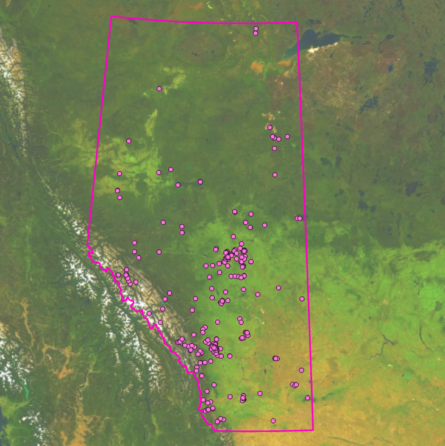

## Item Description
### Title
Aggregated and Cleaned Beaver Occurrence for Alberta, Canada.
### Thumbnail  

### Tags  
beaver, American Beaver, Castor, Castor canadensis, Edmonton, Alberta, Canada, GBIF
### Summary (Purpose)  
This dataset was created to investigate the effect of spatial and temporal data cleaning meathods on the performance of logistic regression model prediction outputs.
### Description (Abstract)    
This point feature class contains cleaned outputs from the GBIF Castor canadensis occurrence data download for Alberta, Canada. Observations were projected from WGS 1980 to NAD 1983 10TM AEP Forest then filtered to remove any records with over 500m of GPS inaccuracy indicated in the datable variable
"coordinateUncertaintyInMeatures". Then, any records not within 500m of a stream from the Alberta Base Stream and Flow Representation Layer were removed. Spatially near records were then aggregated using the *Group by Proximity* tool with a 100m radius and *Mean-Cenetered* to produce a single point for each grouping.
See [#### Source Layer Attribution] for further detail on data sources.

#### Spatial Reference Information  
Cell Resolution: 25m  
Projected Coordinate System; NAD 1983 10TM AEP Forest  
Projection: Transverse Mercator  
WKID: 3400  
Authority: EPSG  
Linear Unit: Meters (1.0)  
False Easting: 500000.0  
False Northing: 0.0  
Central Meridian -115.0  
Scale Factor: 0.9992  
Latitude Of Origin: 0.0  
### Credits  
Cartographer: Kyle Taylor, University of Alberta, kwtaylor@ualberta.ca.
Created: 2024-12-06
#### Source Layer Attributions
ABMI. 2015. Alberta Backfilled Wall-to-Wall Vegetation Layer. Raster, https://abmi.ca/home/data-analytics/da-top/da-product-overview/Data-Archive/Detailed-Vegetation-Maps.html

Alberta Environment and Protected Areas. 2015. Alberta Merged Wetland Inventory. Geodatabase, https://geodiscover.alberta.ca/geoportal/rest/metadata/item/bfa8b3fdf0df4ec19f7f648689237969/html.

Global Biodiversity Information Facility. 2024. GBIF Occurrence Download. Table, https://doi.org/10.15468/dl.ukgnss.
### Use Limitation  
This layer can be used with attribution for non-commercial purposes. This object was created for educational purposes and accuracy is not guaranteed.
### Appropriate Scale  
1:50,000 to 1:5,000
### Extent (Decimal Degrees)  
West: -113.9088197  
East: -113.1321093  
South: 53.2762464  
North: 53.7460180  
