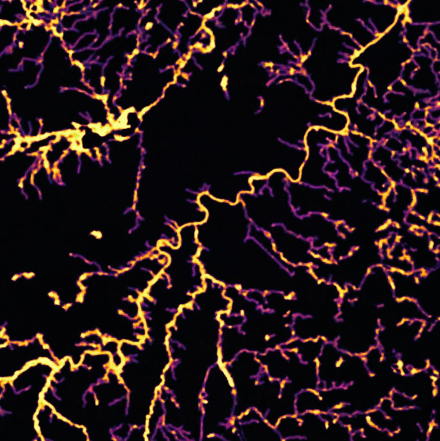

## Item Description
### Title
CASCAM Model 1 Prediction Layer - Edmonton
### Thumbnail  

### Tags
beaver, American Beaver, Castor, Castor canadensis, Edmonton, Alberta, Canada, habitat, species distribution, logistic
### Summary (Purpose)
This dataset was created for educational purposes to understand the application of logistic spatial regression models to publicly available citizen science data.
### Description (Abstract)
This raster layer is the output of a logistic regression model giving occupancy probability of American beaver (Castor canadensis) in Edmonton, Alberta, Canada. The model was fit to 5 environmental variable predictor layers with a cell size of 25x25m: Marsh density within a 200 m radius, Anthropogenic density within a 200m radius, Open Water Wetland density within a 200m radius, Deciduous Forest/Shrub density within a 200 m radius, and mean distance from stream within a 200m radius. The marshes and open water wetland layers were extracted from the Alberta Merged Wetland Inventory. The deciduous tree cover was extracted from the ABMI Back-Filled Wall-to-Wall Vegetation Layer. Beaver occurrence data from Global Biodiversity Information Facility (GBIF).  See credits for further detail on data sources.
#### Spatial Reference Information
Cell Resolution: 25m  
Projected Coordinate System; NAD 1983 10TM AEP Forest  
Projection: Transverse Mercator  
WKID: 3400  
Authority: EPSG  
Linear Unit: Meters (1.0)  
False Easting: 500000.0  
False Northing: 0.0  
Central Meridian -115.0  
Scale Factor: 0.9992  
Latitude Of Origin: 0.0  
### Credits
Cartographer: Kyle Taylor, University of Alberta, kwtaylor@ualberta.ca.
Created: 2024-12-06
#### Source Layer Attributions
ABMI. 2015. Alberta Backfilled Wall-to-Wall Vegetation Layer. Raster, https://abmi.ca/home/data-analytics/da-top/da-product-overview/Data-Archive/Detailed-Vegetation-Maps.html

Alberta Environment and Protected Areas. 2015. Alberta Merged Wetland Inventory. Geodatabase, https://geodiscover.alberta.ca/geoportal/rest/metadata/item/bfa8b3fdf0df4ec19f7f648689237969/html.

Global Biodiversity Information Facility. 2024. GBIF Occurrence Download. Table, https://doi.org/10.15468/dl.ukgnss.
### Use Limitation
This layer can be used with attribution for non-commercial purposes. This object was created for educational purposes and accuracy is not guaranteed.
### Appropriate Scale
1:50,000 to 1:5,000
### Extent (Decimal Degrees)
West: -113.9088197  
East: -113.1321093  
South: 53.2762464  
North: 53.7460180  
